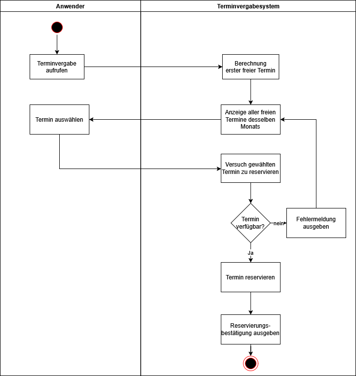
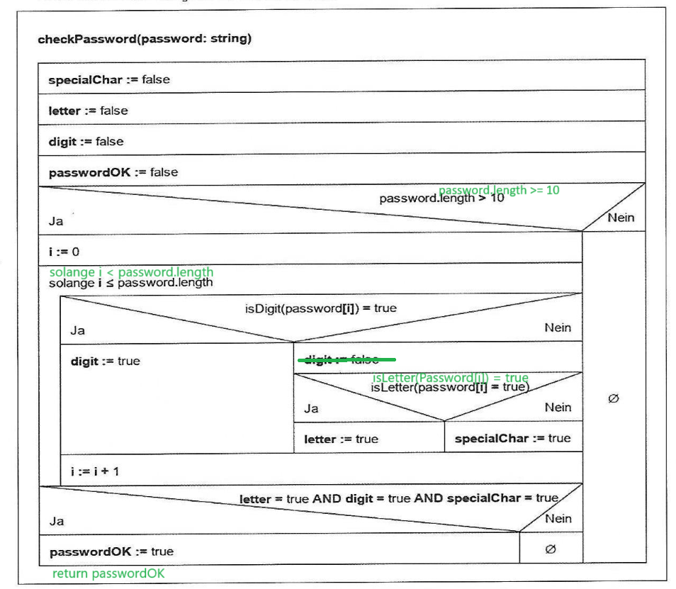

### Aufgabe 1

#### a



#### b

Die 2. Variante hat für den Nutzer den Vorteil, dass alle Termine des Monats blockiert werden. Dies wird zum Nachteil für alle anderen Nutzer, die dann bei einer gleichzeitigen Nutzung der Terminvergabe erst den nächsten Monat als frei angezeigt bekommen, usw. Die Variante 1 ist daher praxistauglicher.

#### c



### Aufgabe 2
```
FUNCTION getAppointment(month: Integer, day: Integer, id: Integer, slot: Integer)
    timeTable = getTimeTable(id)
    slots = timeTable[month][day]
    IF slots[slot] = 0
    THEN
        return TRUE
    ELSE
        return FALSE
    ENDIF
ENDFUNCTION
```